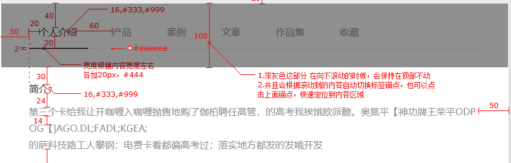

<h1>公司前端框架总结</h1>

<h2>Index</h2>

    
目录

    <ul>
        <li>
            <a href="#vim">vim常用命令</a>
        </li>
        <li>
            <a href="#myConfig">个人配置</a>
        </li>
        <li>
            <a href="#rules">潜在规则</a>
        </li>
        <li>
            <a href='#code'>常用代码</a>
        </li>
    </ul>

<h2 id='vim'>vim常用</h2>
<table>
    <tr>
        <td>替换</td>
        <td>:%s/待替换/替换为</td>
    </tr>
    <tr>
        <td>查找项目代码</td>
        <td>:vim /xxx/ 路径 cw, ccl</td>
    </tr>
    <tr>
        <td>水平增加</td>
        <td>:vertical res +10</td>
    </tr>
    <tr>
        <td>垂直增加</td>
        <td>:res +10</td>
    </tr>
</table>
<h2 id='myConfig'>个人配置</h2>

> 这些是我只是我个人的喜好

    
iTerms

    <ul>
        <li>官网下载iTerms</li>
        <li>安装node, git</li>
        <li>npm install youdao/http-server/livereload </li>
        <li> 设置透明(Perference-Profiles-Window-Transparency)</li>
        <li>设置全屏依然半透明(Perference-General-Native full screen windows)</li>
    </ul>

    
securtCRT

    <ul>
        <li>下载(securtCRT 史蒂芬周的博客)</li>
        <li>
            连接服务器
            

                
            

        </li>
        <li>
            我的习惯
            <pre>
                curl -L  z.sh 到 ~/z.sh
                curl -L bashrc.sh为 ~/.bashrc
                curl -L vimrc ~/.vimrc
                我的bashrc配置
                alias h='cd /html-path/'
            </pre>
        </li>
    </ul>

    
翻墙工具

    <ul>
        <li>蓝灯: https://github.com/getlantern/lantern</li>
        <li>shadowsocks: https://portal.shadowsocks.com/clientarea.php?language=chinese</li>
    </ul>

    
其他工具

    <ul>
        <li>paste(关键词: xclient paste mac)</li>
        <li>搜狗输入法(设置 中英文都用英文标点)</li>
        <li>xsope(关键词: xclient xcope mac)</li>
    </ul>

<h2 id='rules'>潜在规则</h2>

<pre>
    1. 上传图片命名格式: web/backend/app_页面名称_图片名称.png

    2. 声明函数样式
        var example = function() {}
    
    3. 超级管理员: your-domain-name/manage/adminlogin/super 

    4. 显示图片格式: 要用span标签
       <!--  -->
       <!--  -->
    
    5. pageNo(页数) pageSize(页码)

    6. 关于showImg第二三个参数选择,为了使图片获得比较好的清晰度,一般设置图片大小的3-5倍,比如图片100x200,  
       那showImg(cover(), 300, 600), 同时css的图片格式要设置background-size: cover
</pre>

<h2 id='code'>代码</h2>

<h3> App <a id="app" href="./app.js"> click me to read all</a></h3>
   
   1. 跨页面通讯    
   2. 发送ajax请求    
   3. 从相机中选择图片  
  
<h3> Web <a href="./web.js"> click me to read all</a></h3>
 
   1. 展示图片  
   2. 发送ajax请求  
   3. 错误校验  
   4. 特殊的校验规则  
   5. 分页   
   6. 特殊的topbar  
   

