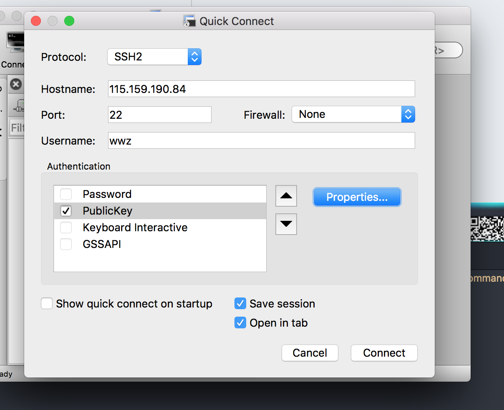

<h1>公司前端框架总结</h1>

<h2>Index</h2>

    
目录

    <ul>
        <a href="#myConfig">我的配置</a>
        <li>app</li>
        <li>web</li>
        <li>backend</li>
        <li>数据库</li>
    </ul>

<h2 id='myConfig'>我的配置</h2>
<ul>
    

        
iTerms

        <ul>
        <li>官网下载iTerms</li>
        <li>安装node, git</li>
        <li>npm youdao/http-server -c-1 </li>
        <li> 设置透明(Perference-Profiles-Window-Transparency)</li>
        <li>设置全屏依然半透明(Perference-General-Native full screen windows)</li>
    

    

        
securtCRT

        <ul>
            <li>下载(securtCRT 史蒂芬周的博客)</li>
            <li>
                连接服务器
                

                    
                

            </li>
            <li>
                我的习惯 
                <pre>
                    curl -L  z.sh 到 ~/z.sh  
                    curl -L bashrc.sh为 ~/.bashrc
                    curl -L vimrc ~/.vimrc
                </pre>
            </li>
        </ul>
    

    

        
翻墙工具

        <ul> 
           <li>蓝灯: https://github.com/getlantern/lantern</li>
           <li>shadowsocks: https://portal.shadowsocks.com/clientarea.php?language=chinese</li>
        </ul>
    

    

        

        <pre></pre>
    

    

        

        <pre></pre>
    

    

        

        <pre></pre>
    

    

        

        <pre></pre>
    

    
svn

    
iTerm

    
shadowsocks/lantern

    
paste

    
搜狗输入法

    
xscope

    
apiCloud

</ul>

