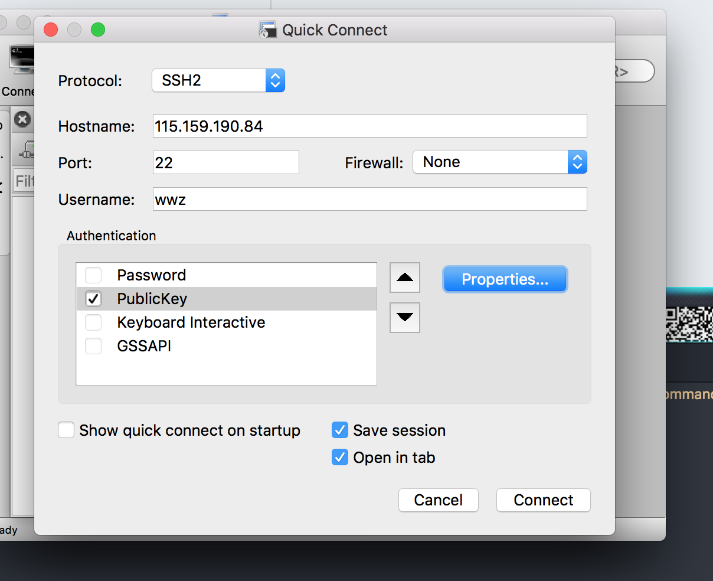

<h1>公司前端框架总结</h1>

<h2>Index</h2>

    
目录

    <ul>
        <li><a href="#vim">vim常用命令</a></li>
        <li><a href="#myConfig">我的配置</a></li>
        <li><a href="#app">app</a></li>
        <li><a href='#web'>web</a></li>
    </ul>

<h2 id='vim'>vim常用</h2>

<table>
    <tr>
        <td>替换</td>
        <td>:%s/待替换/替换为</td>
    </tr>
    <tr>
        <td>查找项目代码</td>
        <td>:vim /xxx/ 路径 cw, ccl</td>
    </tr>
    <tr>
        <td>水平增加</td>
        <td>:vertical res +10</td>
    </tr>
    <tr>
        <td>垂直增加</td>
        <td>:res +10</td>
    </tr>
</table>
<h2 id='myConfig'>我的配置</h2>
<ul>
    

        
iTerms

        <ul>
            <li>官网下载iTerms</li>
            <li>安装node, git</li>
            <li>npm install  youdao/http-server/livereload </li>
            <li> 设置透明(Perference-Profiles-Window-Transparency)</li>
            <li>设置全屏依然半透明(Perference-General-Native full screen windows)</li>
        </ul>
    

    

        
securtCRT

        <ul>
            <li>下载(securtCRT 史蒂芬周的博客)</li>
            <li>
                连接服务器
                

                    
                

            </li>
            <li>
                我的习惯
                <pre>
                    curl -L  z.sh 到 ~/z.sh
                    curl -L bashrc.sh为 ~/.bashrc
                    curl -L vimrc ~/.vimrc

                    我的bashrc配置
                    
                    alias h='cd /html-path/'
                </pre>
            </li>
        </ul>
    

    

        
翻墙工具

        <ul>
            <li>蓝灯: https://github.com/getlantern/lantern</li>
            <li>shadowsocks: https://portal.shadowsocks.com/clientarea.php?language=chinese</li>
        </ul>
    

    
    

        
其他工具

        <ul>
            <li>paste(关键词: xclient paste mac)</li>
            <li>搜狗输入法(设置 中英文都用英文标点)</li>
            <li>xsope(关键词: xclient xcope mac)</li>
        </ul>
    

</ul>

<h2 id="app">app常用代码</h2>

  
跨页面通信

  
使用这个方法之前,这两个页面需已经用openWin方法打开了

  <pre>
    // 写在当前页面
    var arg = {
      type: 'refresh',
    }
    var jsFun = 'init(' + JSON.stringify(arg) + ')';
    api.execScript({
      name: 'xxx',
      script: jsFun
    })

    // 写在接受信息的页面, 这些一般写在init里面
    var arg = arguments[0] ? arguments[0] : '';
    if (arg) {
      switch (arg.type) {
        case 'refresh':
          // ....
          break;
      }
    }
  </pre>

  
发送Ajax请求

  <pre>
    self.errors = ko.validation.group([])
    self.isValid = ko.computed(function() {
        return self.errors().length === 0;
    })

    self.setUser = function() {
        if (!self.isValid()) {
            api.toast({
                msg: self.errors()[0],
                location: 'middle'
            });
            return false;
        }

        var modelData = {}

        if (self.qq.hasChanges()) {
            modelData.qq = self.qq();
        }

        if ($.fn.isEmpty(modelData)) {
            api.toast({
                msg: '没有进行任何修改',
                location: 'middle'
            });
            return false;
        }

        $('.spinner').show();
        api.ajax({
            url: webhost + '/app/user/setpost',
            method: 'post',
            headers: {
                "user-agent": navigator.userAgent,
                "Cookie": 'PHPSESSID=' + $api.getStorage('PHPSESSID'),
                "X-Requested-With": 'XMLHttpRequest'
            },
            data: {
                body: JSON.stringify(modelData)
            }
        }, function(ret, err) {
            if (ret) {
                switch (ret.code) {
                    case 1:
                        self.commit();
                        self.beginEdit();
                        api.toast({
                            msg: '保存修改成功!',
                            location: 'middle'
                        });

                        break;
                    case 911:
                        api.openWin({
                            name: 'login',
                            url: 'widget://html/login.html'
                        });
                        break;
                    case 2003:
                        api.toast({
                            msg: ret.message,
                            location: 'middle'
                        });
                        break;
                    default:
                        api.toast({
                            msg: '保存修改失败!',
                            location: 'middle'
                        });
                }
            } else {
                api.toast({
                    msg: err.msg,
                    location: 'middle'
                });
            }
            $('.spinner').hide();
        });
    }
  </pre>

  
从相机在选择图片

  <pre>
    <!--
    /* html * /
    

        

            <button tapmode data-bind="click: cameraClick.bind($data, 180, 180)">拍照</button>
            <button tapmode data-bind="click: albumClick.bind($data, 180, 180)">从手机相册选择</button>
            <button tapmode data-bind="click: cancelChooseClick">取消</button>
        

    

    -->
    /* js * /
    self.cameraClick = function() {
        $('#choose').removeClass('show');
        api.getPicture({
            sourceType: 'camera',
            mediaValue: 'pic',
            destinationType: 'url',
            quality: 100
        }, function(ret, err) {
            if (ret.data == '') {
                return false;
            }
            if (ret) {
                qcloudCos.initCOSClient({
                    appId: jsParam.appId,
                    region: jsParam.region,
                });
                api.showProgress({
                    style: 'default',
                    animationType: 'fade',
                    title: '图片上传',
                    modal: false
                });
                var cosPath = 'company/' + (new Date()).valueOf()
                qcloudCos.putObject({
                    bucket: jsParam.bucket,
                    cosPath: cosPath,
                    localPath: ret.data,
                    insertOnly: "1",
                    sign: jsParam.upToken
                }, function(res) {
                    if (res.type == 'onProgress') {
                        var progress = (res.currentSize / res.totalSize * 100).toFixed(0) + '%';
                    } else if (res.type == 'onComplete') {
                        self.headimgurl(cosPath);
                        api.hideProgress();
                    }
                });
            } else {
                api.toast({
                    msg: '用户取消拍照',
                    location: 'middle'
                });
            }
        });
    }
  </pre>

  
从相册中选取照片

  <pre>
    /* html同上 */
    /* js */
      self.albumClick = function() {
        $('#choose').removeClass('show');
        var w = arguments[0] ? arguments[0] : '';
        var h = arguments[1] ? arguments[1] : '';
        api.getPicture({}, function(ret, err) {
            if (ret) {
                qcloudCos.initCOSClient({
                    appId: jsParam.appId,
                    region: jsParam.region,
                });
                api.showProgress({
                    style: 'default',
                    animationType: 'fade',
                    title: '图片上传',
                    modal: false
                });
                var cosPath = 'company/' + (new Date()).valueOf()
                qcloudCos.putObject({
                    bucket: jsParam.bucket,
                    cosPath: cosPath,
                    localPath: ret.data,
                    insertOnly: "1",
                    sign: jsParam.upToken
                }, function(res) {
                    if (res.type == 'onProgress') {
                        var progress = (res.currentSize / res.totalSize * 100).toFixed(0) + '%';
                    } else if (res.type == 'onComplete') {
                        self.headimgurl(cosPath);
                        api.hideProgress();
                        self.setUser();
                    }
                });
            } else {
                api.toast({
                    msg: '打开相册失败, 请重试!',
                    location: 'middle'
                });
            }
        });
    }
  </pre>

<h2 id="web">web</h2>

<table>
    <tr>
        <td>超级管理员</td>
        <td>manage/adminlogin/super</td>
    </tr>
</table>

    

        <summay>showImg</summay>
        <pre>
        self.showImg = function(img) {
            return 'http://' + jsParam.cdn + '/' + img  ;
        };        
        
        self.showImg = function(img) {
            var w = arguments[1] ? arguments[1] : '';
            var h = arguments[2] ? arguments[2] : '';
            var type = arguments[3] ? arguments[3] : '';
            if (img && w && type) {
                return 'url(http://' + jsParam.cdn + '/' + img + '?imageView2/1/w/' + w + '/h/' + h + '|imageMogr2/size-limit/'+ getImgSize +'!)';
    }
            if (img && w) {
                return 'url(http://' + jsParam.cdn + '/' + img + '?imageView2/1/w/' + w + '/h/' + h + '|imageMogr2/size-limit/'+ listImgSize +'!)';
    }
            return 'url(http://' + jsParam.cdn + '/' + img + ')';
        };
        </pre>
    

    

        
模板

        <pre>
            $('document').ready(funtion(){
                ko.validation.init({
                    errorElementClass: 'has-error',
                    insertMessages: true
                })        
                
                var ViewModel = function() {};

                var viewModel = newViewModel();
                ko.applyBindings(viewModel, document.getElementById());
            })
        </pre>
    

    

        
校验错误

        <pre>
            self.errors = ko.validation.group([]);
            self.isValid = ko.computed(function(){
                return self.errors.length === 0;
            });

            // 验证
            if (!self.isValid()) {
                self.errors.showAllMessages();
                return false;
            }
        </pre>
    

